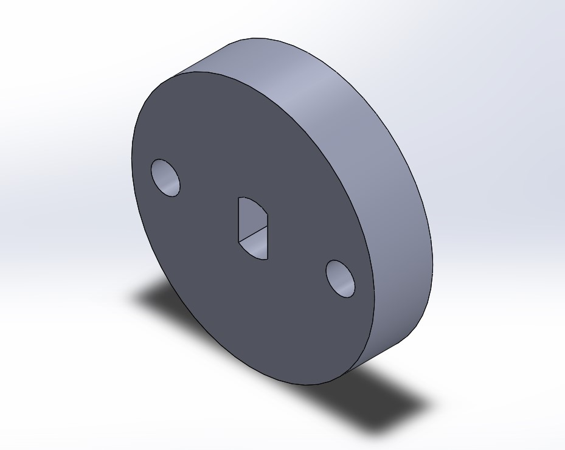

# Kelvin Duong A15822315 and Jerome Lam A15459972  ECE 140A Lab 7

# Intro:

# Structure
ece-140a-winter-2022-duongkelvin75/ece-140a-winter-2022-Jerome2L
- Lab 1
- Lab 2
- Lab 3
- Lab 4
- Lab 5
- Lab 6
- Lab 7
- Lab 8
	- README.md
	- Figures
	- Tutorials
		- GPS.py
		- PID.py
		- Segmentation.py
		- stepper.py
		- Masked_image.py
	- Challenges
		- public
			- rest.js
		- app.py
		- credentials.env
		- GPS.py
		- index.html
		- init-db.py

		
# Tutorials

## Tutorial 1
In this tutorial, we went over the basics of CAD. We already had experience using Solidworks from previous classes so we skipped the fusion tutorial and made the part in Solidworks based on the drawing.

This is our solidworks model

## Tutorial 2
In this tutorial we were introduced to using GPS with the raspberry pi. We step of the configurations provided in the tutorials and tried connecting to the gps. We had a lot of issues with the gps module at the beginning because our antenna was not set up properly and we did not have open access to the sky. AFter fixing these issues we were able to read the gps values from the module and print them out. We were able to get the code to work and print out the longitude and latitude values and open in google maps. We had to invert the latitude values to go West instead of East.

## Tutorial 3
In this tutorial, we used the raspberry pi camera to track objects based on their color. The code reads from the camera then converts to HSV. Then sets 2 ranges for red and mask the 2 ranges. The code gets rid of the red noise. I then connect the components then find the largest object. Then it takes the horizontal distance to the center of that object.

This is a segmented picture of Jeromes hand

## Tutorial 4
In this tutorial, we were introduced to stepper motors which are motors that have a discrete number of steps per rotation. The motor sends pulses to take one step at a time. We set up the circuit according to the provided instructions and copied over the code and ran it. At first, we encountered issues with the motor turning on but it was fixed after we switched out the motor driver to a new one. We timed the motor with half and full steps, Half took 12.54s and Full took 8.97s to complete the code. We saw that the half step took 50% longer than the full steps. We changed the wait time from .002 to .003 for the full step and saw that it took 11.12 seconds to run compared to 8.97. It took longer than expected as we were increasing the wait time.’

## Tutorial 5
In this tutorial we were introduced to PID controls. The Proportional gain changes input proportional to error which causes the most drastic corrections to the error. The derivative provides dampening to reduce major oscillations. The Integral helps remove the steady state error. We set up the code for the camera to track the object with the stepper motor and started to fine tune out PID values. For proportional gain we found that the default value of .003 was already the best value to use. We increased it a alot to .1 but the motor didn’t even turn, we reduced it to .004 and .0035and saw that it was still jittery. The same applied to our integral. We found through multiple rounds of trial and error that the default value given of .001 was best for the derivative. For the integral we increased the value from .001 to .0015 which helped smooth out the motor a little bit. In the end it was able to track out objects fairly well but we did notice the motor was slow, likely due to the nature of the step motor.

## Challenge (Final Boss)
In order to run this product you will need the init-db.py, index.html, rest.js, and app.py.You can use the init-db.py to initialize the database and with the objects HSV, contours, and size columns filled out. Then start app.py to host the server. To use it simply click the track button adjacent to the dropdown which chooses which object to get (red, green, blue) and the camera will look for the object, once it finds it it will return the gps value, and then continue to track the object until it is out of frame. To store the GPS value click the remaining button and that will insert the value into another table ‘found_objects’ initialized through the init-db.py. While running our code we were having hardware issues with the GPS. After getting it to work in tutorial 3 out GPS would not connect while working on the challenge. We spent about 5 collective hours over 2 days trying to get it to connect and it wouldn’t so it is possible that our hardware is damaged. Because of this, we commented out our code to retrieve GPS data and hard coded our coordinates from the tutorial. If we had access to TAs and additional hardware we likely could have resolved these issues but because there was no lab hours finals week we could not fix our hardware issues. Everything else worked as planned including our server and PID. 

[demo](https://www.youtube.com/watch?v=ejVO65KPKso)

